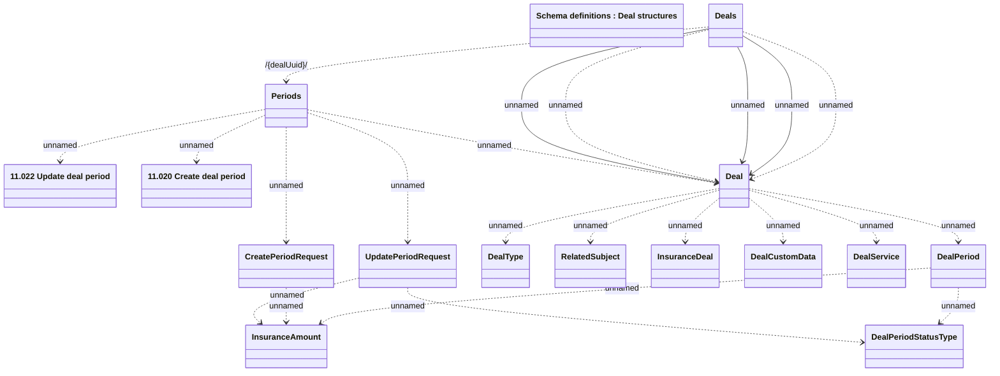

# Create and Update Deal Period

- **Diagram Type**: Logical
- **Package**: HomerSelect/BSL/Modules/Value Added Services (VAS)/Interface Provided/Web Services/VAS Deal Services/Deal Periods_v1
- **Diagram ID**: 154736
- **Elements**: 16
- **Connectors**: 22

