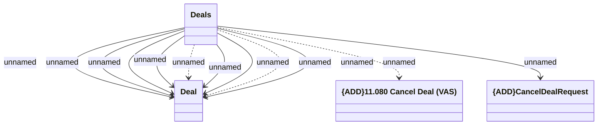

# Cancel Deal

- **Diagram Type**: Logical
- **Package**: HomerSelect/BSL/Modules/Value Added Services (VAS)/Interface Provided/Web Services/VAS Deal Services/Deals_v1
- **Diagram ID**: 158937
- **Elements**: 4
- **Connectors**: 11

