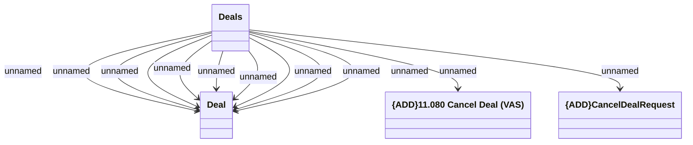

# Cancel Deal

```mermaid
classDiagram
    class ADD_11_080_Cancel_Deal_VAS["{ADD}11.080 Cancel Deal (VAS)"]
    class ADD_CancelDealRequest["{ADD}CancelDealRequest"]
    class Deal["Deal"]
    class Deals["Deals"]
    Deals --> Deal : unnamed
    Deals --> Deal : unnamed
    Deals --> Deal : unnamed
    Deals --> Deal : unnamed
    Deals --> ADD_11_080_Cancel_Deal_VAS : unnamed
    Deals --> Deal : unnamed
    Deals --> ADD_CancelDealRequest : unnamed
    Deals --> Deal : unnamed
    Deals --> Deal : unnamed
    Deals --> Deal : unnamed
    Deals --> Deal : unnamed
```
