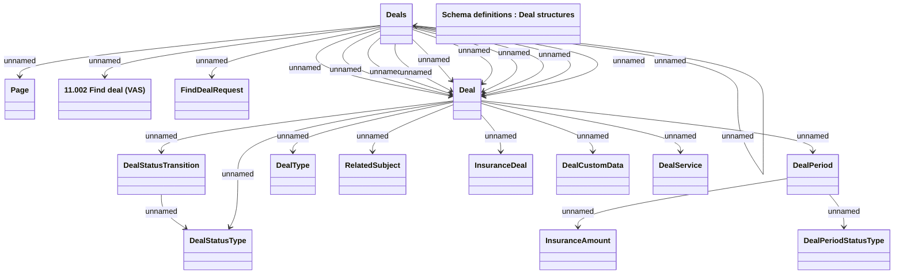

# Find Deal

```mermaid
classDiagram
    class Page["Page"]
    class n_11_002_Find_deal_VAS["11.002 Find deal (VAS)"]
    class Deals["Deals"]
    class FindDealRequest["FindDealRequest"]
    class InsuranceAmount["InsuranceAmount"]
    class DealPeriodStatusType["DealPeriodStatusType"]
    class DealStatusType["DealStatusType"]
    class DealStatusTransition["DealStatusTransition"]
    class DealPeriod["DealPeriod"]
    class DealType["DealType"]
    class RelatedSubject["RelatedSubject"]
    class InsuranceDeal["InsuranceDeal"]
    class DealCustomData["DealCustomData"]
    class DealService["DealService"]
    class Schema_definitions_Deal_structures["Schema definitions : Deal structures"]
    class Deal["Deal"]
    class Deals["Deals"]
    Deal --> DealCustomData : unnamed
    DealPeriod --> InsuranceAmount : unnamed
    DealPeriod --> DealPeriodStatusType : unnamed
    DealStatusTransition --> DealStatusType : unnamed
    Deal --> DealStatusType : unnamed
    Deal --> DealStatusTransition : unnamed
    Deal --> DealPeriod : unnamed
    Deal --> DealType : unnamed
    Deals --> Page : unnamed
    Deal --> InsuranceDeal : unnamed
    Deals --> Deal : unnamed
    Deal --> DealService : unnamed
    Deals --> Deal : unnamed
    Deals --> Deal : unnamed
    Deals --> Deal : unnamed
    Deals --> Deal : unnamed
    Deals --> Deal : unnamed
    Deals --> Deal : unnamed
    Deals --> Deal : unnamed
    Deal --> RelatedSubject : unnamed
    Deals --> Deal : unnamed
    Deals --> Deals : unnamed
    Deals --> n_11_002_Find_deal_VAS : unnamed
    Deals --> FindDealRequest : unnamed
    Deals --> Deal : unnamed
```
