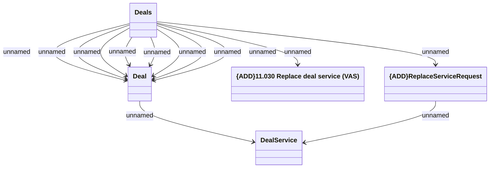

# Replace Deal Service

```mermaid
classDiagram
    class DealService["DealService"]
    class ADD_ReplaceServiceRequest["{ADD}ReplaceServiceRequest"]
    class ADD_11_030_Replace_deal_service_VAS["{ADD}11.030 Replace deal service (VAS)"]
    class Deal["Deal"]
    class Deals["Deals"]
    Deals --> Deal : unnamed
    Deal --> DealService : unnamed
    ADD_ReplaceServiceRequest --> DealService : unnamed
    Deals --> Deal : unnamed
    Deals --> Deal : unnamed
    Deals --> ADD_ReplaceServiceRequest : unnamed
    Deals --> Deal : unnamed
    Deals --> Deal : unnamed
    Deals --> Deal : unnamed
    Deals --> Deal : unnamed
    Deals --> Deal : unnamed
    Deals --> ADD_11_030_Replace_deal_service_VAS : unnamed
```
