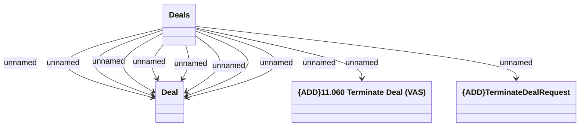

# Terminate Deal

```mermaid
classDiagram
    class ADD_11_060_Terminate_Deal_VAS["{ADD}11.060 Terminate Deal (VAS)"]
    class Deal["Deal"]
    class ADD_TerminateDealRequest["{ADD}TerminateDealRequest"]
    class Deals["Deals"]
    Deals --> Deal : unnamed
    Deals --> Deal : unnamed
    Deals --> Deal : unnamed
    Deals --> Deal : unnamed
    Deals --> Deal : unnamed
    Deals --> Deal : unnamed
    Deals --> ADD_11_060_Terminate_Deal_VAS : unnamed
    Deals --> Deal : unnamed
    Deals --> ADD_TerminateDealRequest : unnamed
    Deals --> Deal : unnamed
```
