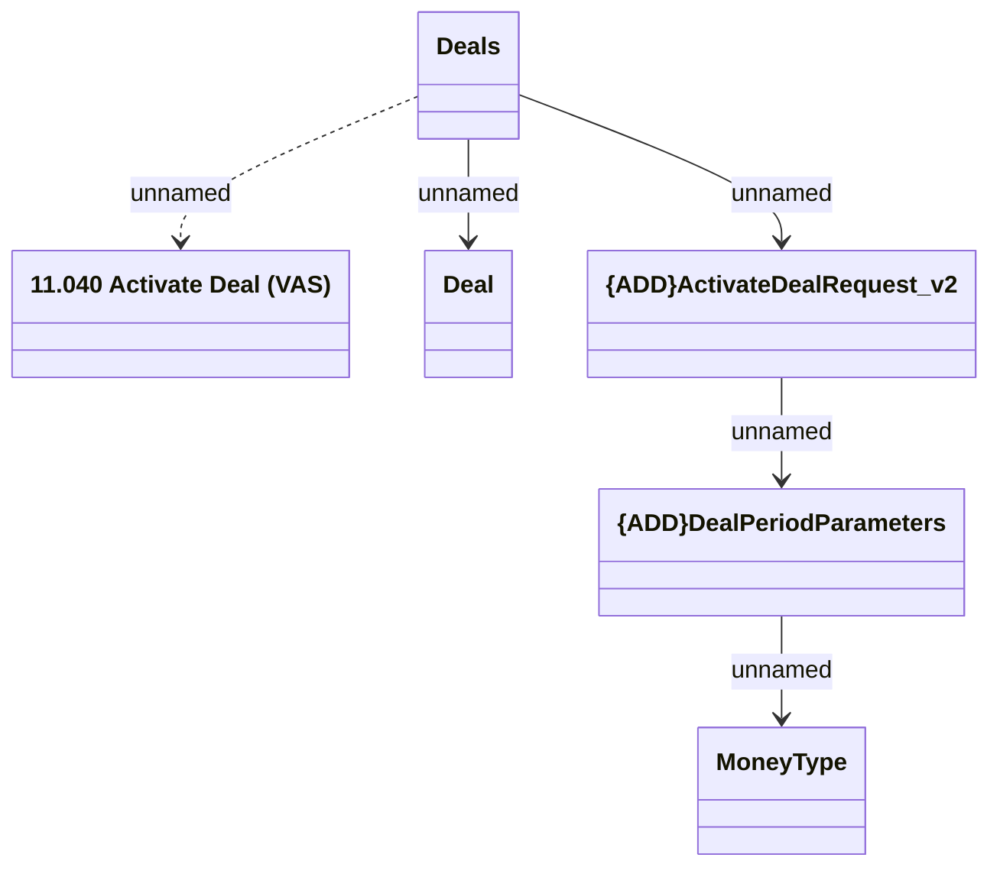

# Deals_v2.Activate Deal

- **Diagram Type**: Logical
- **Package**: HomerSelect/BSL/Modules/Value Added Services (VAS)/Interface Provided/Web Services/VAS Deal Services/Deals_v2
- **Diagram ID**: 159070
- **Elements**: 6
- **Connectors**: 5

