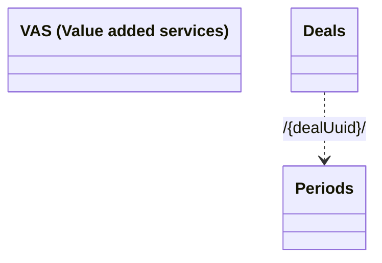

# Resources

- **Diagram Type**: Logical
- **Package**: HomerSelect/BSL/Modules/Value Added Services (VAS)/Interface Provided/Web Services/VAS Deal Services/Resources
- **Diagram ID**: 159047
- **Elements**: 3
- **Connectors**: 1

