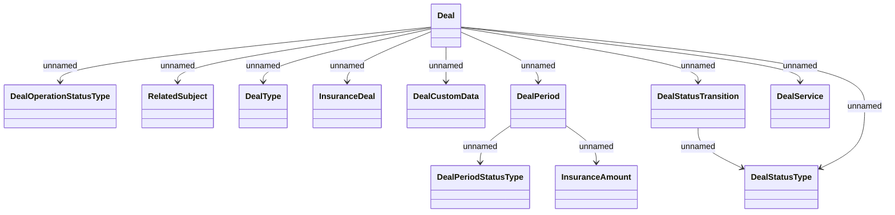

# Deal structures

```mermaid
classDiagram
    class DealOperationStatusType["DealOperationStatusType"]
    class InsuranceAmount["InsuranceAmount"]
    class RelatedSubject["RelatedSubject"]
    class DealType["DealType"]
    class InsuranceDeal["InsuranceDeal"]
    class DealCustomData["DealCustomData"]
    class DealStatusType["DealStatusType"]
    class DealStatusTransition["DealStatusTransition"]
    class DealPeriodStatusType["DealPeriodStatusType"]
    class DealPeriod["DealPeriod"]
    class DealService["DealService"]
    class Deal["Deal"]
    Deal --> DealService : unnamed
    Deal --> DealPeriod : unnamed
    DealPeriod --> DealPeriodStatusType : unnamed
    Deal --> DealStatusTransition : unnamed
    DealStatusTransition --> DealStatusType : unnamed
    Deal --> DealStatusType : unnamed
    Deal --> DealCustomData : unnamed
    Deal --> InsuranceDeal : unnamed
    Deal --> DealType : unnamed
    Deal --> RelatedSubject : unnamed
    DealPeriod --> InsuranceAmount : unnamed
    Deal --> DealOperationStatusType : unnamed
```
