# Changes in LDM

- **Diagram Type**: Logical
- **Package**: HomerSelect/BSL/Modules/Value Added Services (VAS)/Requirement model/CBL-11727 (CSI-376) CSI Modularization - Insurance Contract/Insurance Contract - Changes in LDM
- **Diagram ID**: 146117
- **Elements**: 22
- **Connectors**: 24

```mermaid
classDiagram
    class Insurance_Prolongation_Result["Insurance Prolongation Result"]
    class Insurance_Business_Reason_Type["Insurance Business Reason Type"]
    class Insurance_Operation_Status_Type["Insurance Operation Status Type"]
    class Insurance_Operation_Status["Insurance Operation Status"]
    class Insurance_Custom_Data["Insurance Custom Data"]
    class Insurance_Contract_Status_Transition["Insurance Contract Status Transition"]
    class Insurance_Contract_Status["Insurance Contract Status"]
    class Insurance_Period_Status["Insurance Period Status"]
    class Insurance_Contract_Status_Reason["Insurance Contract Status Reason"]
    class Insurance_Commodity["Insurance Commodity"]
    class Insurance_Subject_Type["Insurance Subject Type"]
    class Insurance_Contract_Type["Insurance Contract Type"]
    class Insurance_Period["Insurance Period"]
    class Insurance_Contract["Insurance Contract"]
    Insurance_Contract ..> Insurance_Subject_Type : unnamed
    Insurance_Contract ..> Insurance_Prolongation_Result : unnamed
    Insurance_Contract_Status_Transition ..> Insurance_Business_Reason_Type : unnamed
    Insurance_Operation_Status ..> Insurance_Operation_Status_Type : unnamed
    unnamed --> Insurance_Operation_Status : unnamed
    Insurance_Contract_Status_Transition --> Insurance_Contract_Status_Transition : unnamed
    unnamed --> Insurance_Contract_Status : unnamed
    Insurance_Contract ..> Insurance_Contract_Status : unnamed
    Insurance_Contract_Status_Transition ..> Insurance_Contract_Status : unnamed
    unnamed --> Insurance_Period_Status : unnamed
    unnamed --> Insurance_Prolongation_Result : unnamed
    Insurance_Contract_Status_Transition ..> Insurance_Contract_Status_Reason : unnamed
    Insurance_Contract o-- Insurance_Commodity : unnamed
    Insurance_Contract ..> Insurance_Contract_Type : unnamed
    unnamed --> Insurance_Period : unnamed
    unnamed --> Insurance_Contract : unnamed
    Insurance_Contract o-- Insurance_Period : unnamed
    unnamed --> Insurance_Contract : unnamed
    Insurance_Contract o-- Insurance_Custom_Data : unnamed
    Insurance_Contract o-- Insurance_Contract_Status_Transition : unnamed
    unnamed --> Insurance_Contract : unnamed
    unnamed --> Insurance_Contract : unnamed
    Insurance_Contract o-- Insurance_Operation_Status : unnamed
    Insurance_Period ..> Insurance_Period_Status : unnamed
```

