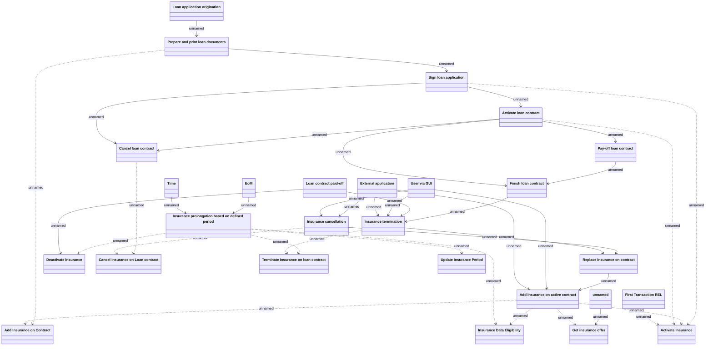

# Insurance BP

- **Diagram Type**: Logical
- **Package**: HomerSelect/BSL/Modules/Value Added Services (VAS)/Requirement model/CBL-11727 (CSI-376) CSI Modularization - Insurance Contract/Insurance business processes
- **Diagram ID**: 134811
- **Elements**: 27
- **Connectors**: 38

