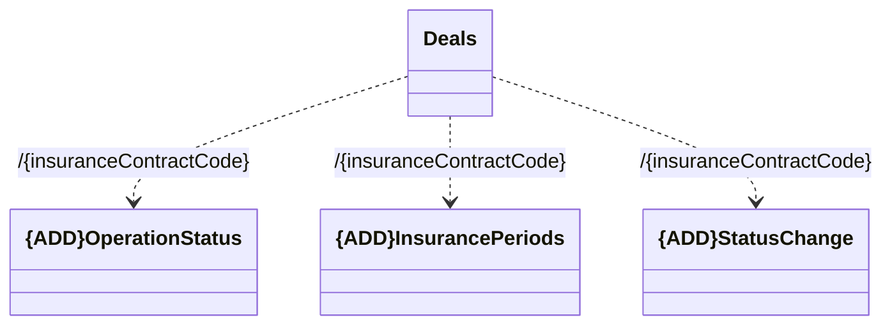

# Resources

- **Diagram Type**: Logical
- **Package**: HomerSelect/BSL/Modules/Value Added Services (VAS)/Requirement model/CBL-11727 (CSI-376) CSI Modularization - Insurance Contract/CSI-377 - Insurance Contract separation - init ANA/Insurance Contract Services/Resources
- **Diagram ID**: 142894
- **Elements**: 4
- **Connectors**: 3

