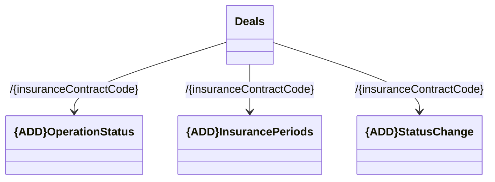

# Resources

```mermaid
classDiagram
    class ADD_StatusChange["{ADD}StatusChange"]
    class ADD_OperationStatus["{ADD}OperationStatus"]
    class ADD_InsurancePeriods["{ADD}InsurancePeriods"]
    class Deals["Deals"]
    Deals --> ADD_OperationStatus : /{insuranceContractCode}
    Deals --> ADD_InsurancePeriods : /{insuranceContractCode}
    Deals --> ADD_StatusChange : /{insuranceContractCode}
```
