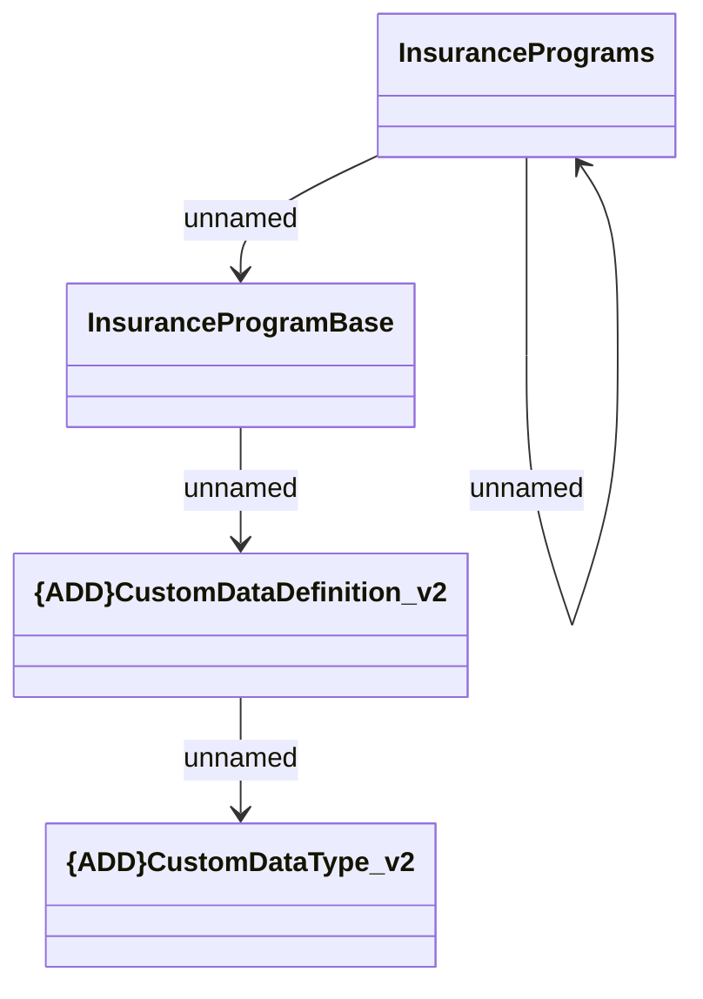

# CSI-769 INSR - Custom data validation API

```mermaid
classDiagram
    class InsurancePrograms["InsurancePrograms"]
    class ADD_CustomDataType_v2["{ADD}CustomDataType_v2"]
    class ADD_CustomDataDefinition_v2["{ADD}CustomDataDefinition_v2"]
    class InsuranceProgramBase["InsuranceProgramBase"]
    class InsurancePrograms["InsurancePrograms"]
    InsurancePrograms --> InsuranceProgramBase : unnamed
    InsuranceProgramBase --> ADD_CustomDataDefinition_v2 : unnamed
    ADD_CustomDataDefinition_v2 --> ADD_CustomDataType_v2 : unnamed
    InsurancePrograms --> InsurancePrograms : unnamed
```
