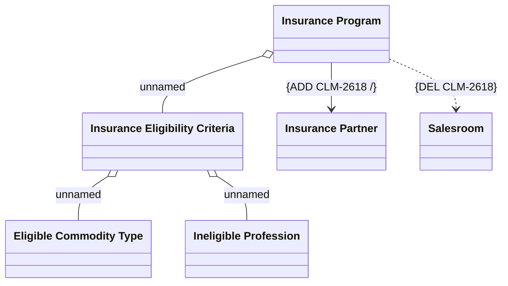

# Insurance Program LDM modification

- **Diagram Type**: Logical
- **Package**: HomerSelect/BSL/Modules/Value Added Services (VAS)/Requirement model/CBL-8512 (CSI-13) CLM Modularization - Insurance Program functionalities/Insurance Program LDM modification
- **Diagram ID**: 134662
- **Elements**: 6
- **Connectors**: 5

