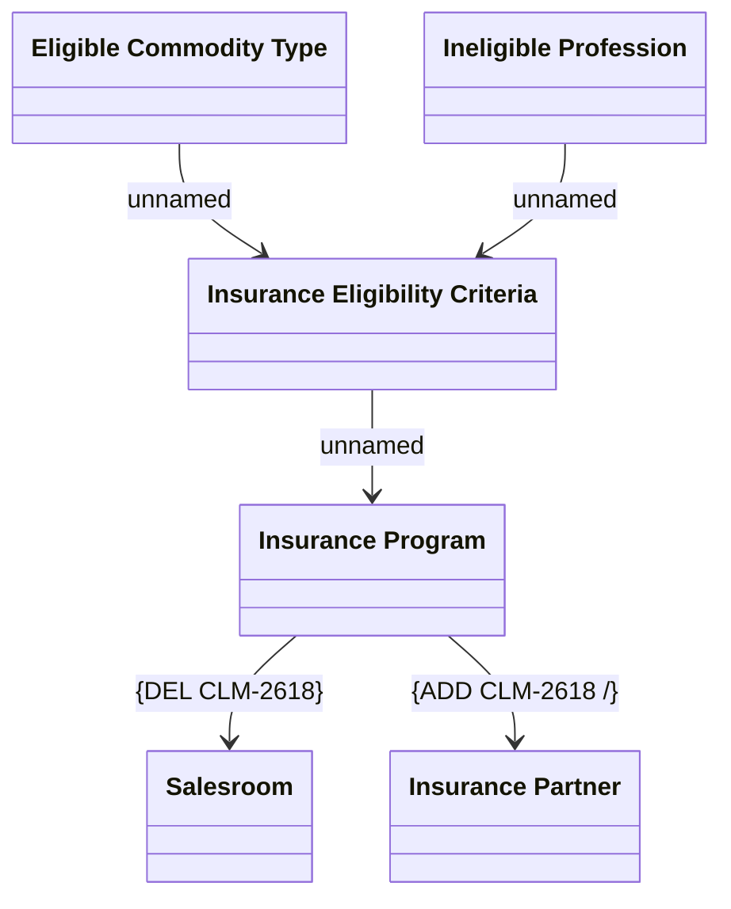

# Insurance Program LDM modification

```mermaid
classDiagram
    class Ineligible_Profession["Ineligible Profession"]
    class Eligible_Commodity_Type["Eligible Commodity Type"]
    class Insurance_Eligibility_Criteria["Insurance Eligibility Criteria"]
    class Insurance_Partner["Insurance Partner"]
    class Salesroom["Salesroom"]
    class Insurance_Program["Insurance Program"]
    Insurance_Eligibility_Criteria --> Insurance_Program : unnamed
    Insurance_Program --> Salesroom : {DEL CLM-2618}
    Insurance_Program --> Insurance_Partner : {ADD CLM-2618 /}
    Eligible_Commodity_Type --> Insurance_Eligibility_Criteria : unnamed
    Ineligible_Profession --> Insurance_Eligibility_Criteria : unnamed
```
