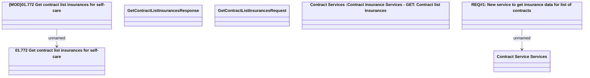

# CBL-1110 (CLM-935) New service to get insurance data for list of contracts

```mermaid
classDiagram
    class MOD_01_772_Get_contract_list_insurances_for_self_care["{MOD}01.772 Get contract list insurances for self-care"]
    class Contract_Service_Services["Contract Service Services"]
    class GetContractListInsurancesResponse["GetContractListInsurancesResponse"]
    class GetContractListInsurancesRequest["GetContractListInsurancesRequest"]
    class n_01_772_Get_contract_list_insurances_for_self_care["01.772 Get contract list insurances for self-care"]
    class Contract_Services_Contract_Insurance_Services_GET_Contract_l["Contract Services :Contract Insurance Services - GET: Contract list Insurances"]
    class REQ_1_New_service_to_get_insurance_data_for_list_of_contract["REQ#1: New service to get insurance data for list of contracts"]
    REQ_1_New_service_to_get_insurance_data_for_list_of_contract --> Contract_Service_Services : unnamed
    MOD_01_772_Get_contract_list_insurances_for_self_care --> n_01_772_Get_contract_list_insurances_for_self_care : unnamed
```
