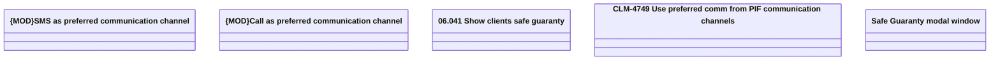

# CBL-16452 (CLM-4749) Use preferred comm from PIF communication channels

```mermaid
classDiagram
    class MOD_SMS_as_preferred_communication_channel["{MOD}SMS as preferred communication channel"]
    class MOD_Call_as_preferred_communication_channel["{MOD}Call as preferred communication channel"]
    class n_06_041_Show_clients_safe_guaranty["06.041 Show clients safe guaranty"]
    class CLM_4749_Use_preferred_comm_from_PIF_communication_channels["CLM-4749 Use preferred comm from PIF communication channels"]
    class Safe_Guaranty_modal_window["Safe Guaranty modal window"]
```
