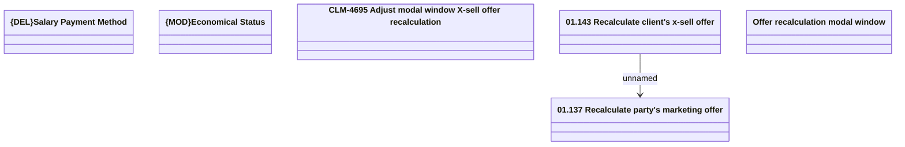

# CBL-16723 (CLM-4695) Adjust modal window X-sell offer recalculation

- **Diagram Type**: Logical
- **Package**: HomerSelect/BSL/Requirements Model/Finished/CLM/CBL-16723 (CLM-4695) Adjust modal window X-sell offer recalculation
- **Diagram ID**: 145188
- **Elements**: 6
- **Connectors**: 1

