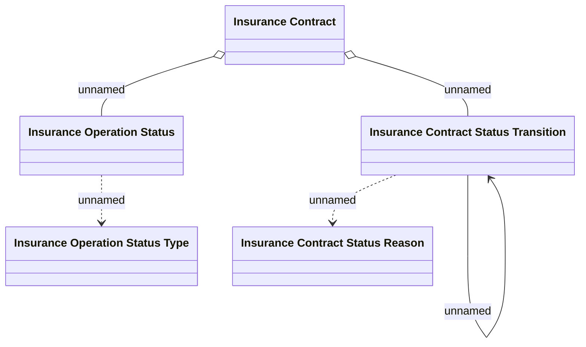

# Insurance domain changes

- **Diagram Type**: Logical
- **Package**: HomerSelect/BSL/Requirements Model/Finished/CLM/CBL-2620 (CLM-1155) New insurance types for REL products
- **Diagram ID**: 105603
- **Elements**: 5
- **Connectors**: 5

