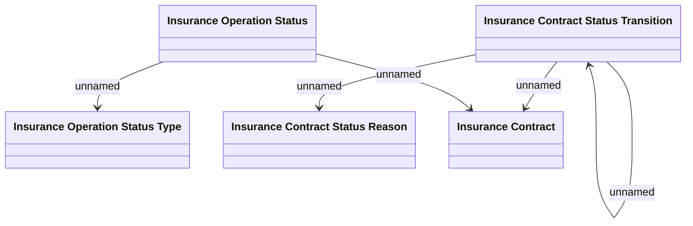

# Insurance domain changes

```mermaid
classDiagram
    class Insurance_Operation_Status_Type["Insurance Operation Status Type"]
    class Insurance_Operation_Status["Insurance Operation Status"]
    class Insurance_Contract_Status_Transition["Insurance Contract Status Transition"]
    class Insurance_Contract_Status_Reason["Insurance Contract Status Reason"]
    class Insurance_Contract["Insurance Contract"]
    Insurance_Contract_Status_Transition --> Insurance_Contract_Status_Transition : unnamed
    Insurance_Contract_Status_Transition --> Insurance_Contract_Status_Reason : unnamed
    Insurance_Contract_Status_Transition --> Insurance_Contract : unnamed
    Insurance_Operation_Status --> Insurance_Operation_Status_Type : unnamed
    Insurance_Operation_Status --> Insurance_Contract : unnamed
```
