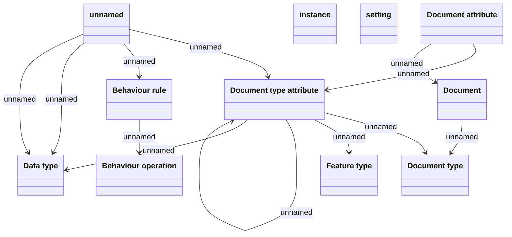

# Document purpose

```mermaid
classDiagram
    class Data_type["Data type"]
    class Document_attribute["Document attribute"]
    class Behaviour_operation["Behaviour operation"]
    class Document["Document"]
    class Behaviour_rule["Behaviour rule"]
    class Document_type_attribute["Document type attribute"]
    class Feature_type["Feature type"]
    class Document_type["Document type"]
    class instance["instance"]
    class setting["setting"]
    Document --> Document_type : unnamed
    Document_type_attribute --> Document_type : unnamed
    Document_type_attribute --> Feature_type : unnamed
    unnamed --> Document_type_attribute : unnamed
    Document_attribute --> Document_type_attribute : unnamed
    Document_type_attribute --> Document_type_attribute : unnamed
    unnamed --> Behaviour_rule : unnamed
    Document_attribute --> Document : unnamed
    Behaviour_rule --> Behaviour_operation : unnamed
    unnamed --> Data_type : unnamed
    unnamed --> Data_type : unnamed
    Document_type_attribute --> Data_type : unnamed
```
