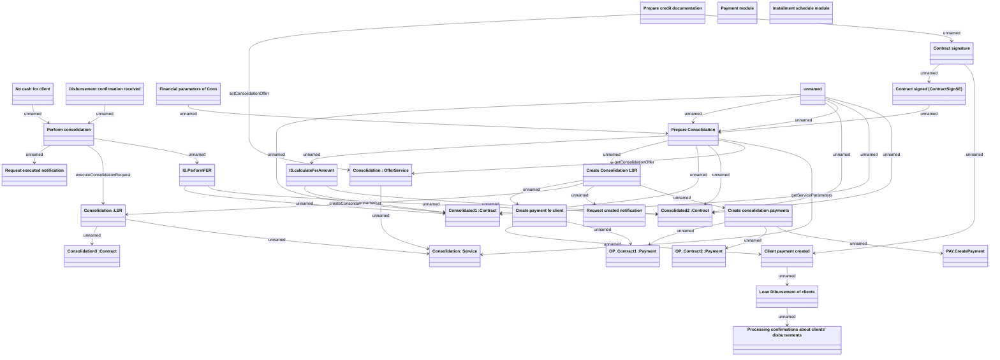

# Consolidation #1 x-sell - Business process idea

```mermaid
classDiagram
    class Consolidation_OfferService["Consolidation : OfferService"]
    class PAY_CreatePayment["PAY.CreatePayment"]
    class OP_Contract1_Payment["OP_Contract1 :Payment"]
    class OP_Contract2_Payment["OP_Contract2 :Payment"]
    class OP_Contract1_Payment["OP_Contract1 :Payment"]
    class Contract_signature["Contract signature"]
    class Consolidation_Service["Consolidation: Service"]
    class Processing_confirmations_about_clients_disbursements["Processing confirmations about clients' disbursements"]
    class Request_executed_notification["Request executed notification"]
    class Request_created_notification["Request created notification"]
    class No_cash_for_client["No cash for client"]
    class IS_calculateFerAmount["IS.calculateFerAmount"]
    class Client_payment_created["Client payment created"]
    class Loan_Dibursement_of_clients["Loan Dibursement of clients"]
    class Perform_consolidation["Perform consolidation"]
    class Disbursement_confirmation_received["Disbursement confirmation received"]
    class Prepare_Consolidation["Prepare Consolidation"]
    class IS_PerformFER["IS.PerformFER"]
    class Financial_parameters_of_Cons["Financial parameters of Cons"]
    class Create_payment_fo_client["Create payment fo client"]
    class Create_consolidation_payments["Create consolidation payments"]
    class Prepare_credit_documentation["Prepare credit documentation"]
    class Consolidation_LSR["Consolidation :LSR"]
    class Consolidated2_Contract["Consolidated2 :Contract"]
    class Consolidated1_Contract["Consolidated1 :Contract"]
    class Consolidation3_Contract["Consolidation3 :Contract"]
    class Create_Consolidation_LSR["Create Consolidation LSR"]
    class Contract_signed_ContractSignSE["Contract signed (ContractSignSE)"]
    class Payment_module["Payment module"]
    class Installment_schedule_module["Installment schedule module"]
    Create_payment_fo_client --> Client_payment_created : unnamed
    Create_Consolidation_LSR --> Create_payment_fo_client : unnamed
    Consolidation_LSR --> Consolidation3_Contract : unnamed
    Consolidation_LSR --> Consolidation_Service : unnamed
    Prepare_credit_documentation --> Consolidation_OfferService : setConsolidationOffer
    Prepare_credit_documentation --> Contract_signature : unnamed
    Create_consolidation_payments --> OP_Contract1_Payment : unnamed
    Create_consolidation_payments --> OP_Contract2_Payment : unnamed
    Prepare_Consolidation --> IS_calculateFerAmount : unnamed
    Create_payment_fo_client --> OP_Contract1_Payment : unnamed
    Create_Consolidation_LSR --> Consolidation_LSR : createConsolidationRequest
    Financial_parameters_of_Cons --> Prepare_Consolidation : unnamed
    IS_PerformFER --> Consolidated1_Contract : unnamed
    IS_PerformFER --> Consolidated2_Contract : unnamed
    Prepare_Consolidation --> Create_Consolidation_LSR : unnamed
    Prepare_Consolidation --> Consolidated1_Contract : unnamed
    Prepare_Consolidation --> Consolidated2_Contract : unnamed
    Prepare_Consolidation --> Consolidation_OfferService : getConsolidationOffer
    Prepare_Consolidation --> Consolidation_Service : getServiceParameters
    Create_consolidation_payments --> PAY_CreatePayment : unnamed
    unnamed --> Consolidated1_Contract : unnamed
    Perform_consolidation --> Request_executed_notification : unnamed
    Perform_consolidation --> Consolidation_LSR : executeConsolidationRequest
    Perform_consolidation --> IS_PerformFER : unnamed
    Loan_Dibursement_of_clients --> Processing_confirmations_about_clients_disbursements : unnamed
    Client_payment_created --> Loan_Dibursement_of_clients : unnamed
    IS_calculateFerAmount --> Consolidated1_Contract : unnamed
    IS_calculateFerAmount --> Consolidated2_Contract : unnamed
    unnamed --> Prepare_Consolidation : unnamed
    Create_Consolidation_LSR --> Request_created_notification : unnamed
    unnamed --> Consolidated2_Contract : unnamed
    Create_Consolidation_LSR --> Create_consolidation_payments : unnamed
    unnamed --> Prepare_Consolidation : unnamed
    Contract_signature --> Contract_signed_ContractSignSE : unnamed
    Contract_signature --> Client_payment_created : unnamed
    unnamed --> Consolidated1_Contract : unnamed
    unnamed --> Consolidated2_Contract : unnamed
    Consolidation_OfferService --> Consolidation_Service : unnamed
    Contract_signed_ContractSignSE --> Prepare_Consolidation : unnamed
    Disbursement_confirmation_received --> Perform_consolidation : unnamed
    No_cash_for_client --> Perform_consolidation : unnamed
```
