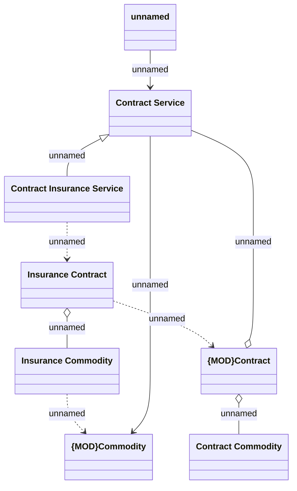

# Insurance Commodity domain

- **Diagram Type**: Logical
- **Package**: HomerSelect/BSL/Requirements Model/Finished/CLM/CLM-99 (CBL-31) Commodity Module separation
- **Diagram ID**: 98787
- **Elements**: 8
- **Connectors**: 9

