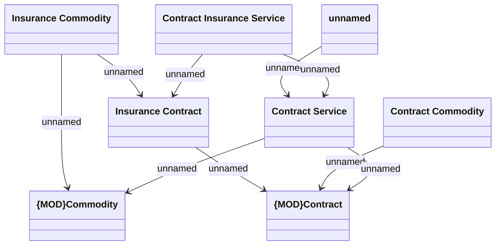

# Insurance Commodity domain

```mermaid
classDiagram
    class Contract_Commodity["Contract Commodity"]
    class MOD_Commodity["{MOD}Commodity"]
    class Contract_Service["Contract Service"]
    class MOD_Contract["{MOD}Contract"]
    class Contract_Insurance_Service["Contract Insurance Service"]
    class Insurance_Commodity["Insurance Commodity"]
    class Insurance_Contract["Insurance Contract"]
    unnamed --> Contract_Service : unnamed
    Insurance_Commodity --> Insurance_Contract : unnamed
    Insurance_Contract --> MOD_Contract : unnamed
    Insurance_Commodity --> MOD_Commodity : unnamed
    Contract_Insurance_Service --> Contract_Service : unnamed
    Contract_Commodity --> MOD_Contract : unnamed
    Contract_Service --> MOD_Commodity : unnamed
    Contract_Insurance_Service --> Insurance_Contract : unnamed
    Contract_Service --> MOD_Contract : unnamed
```
