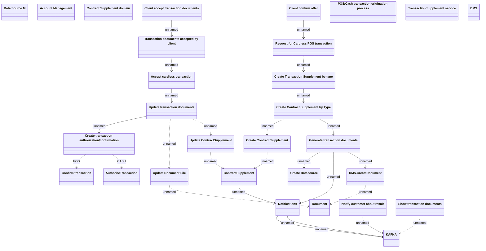

# Processing Cardless Transaction request (BL)

- **Diagram Type**: Logical
- **Package**: HomerSelect/BSL/Requirements Model/Finished/CSI/CBL-16152 (CSI-1340) Contract service modularization - analysis/Processing Cardless Transaction request
- **Diagram ID**: 151168
- **Elements**: 31
- **Connectors**: 25

