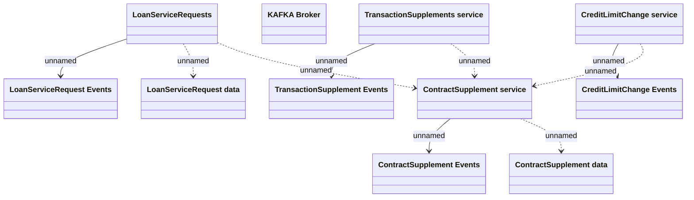

# Processing Cardless Transaction request

- **Diagram Type**: Logical
- **Package**: HomerSelect/BSL/Requirements Model/Finished/CSI/CBL-16152 (CSI-1340) Contract service modularization - analysis/Processing Cardless Transaction request
- **Diagram ID**: 151169
- **Elements**: 11
- **Connectors**: 9

