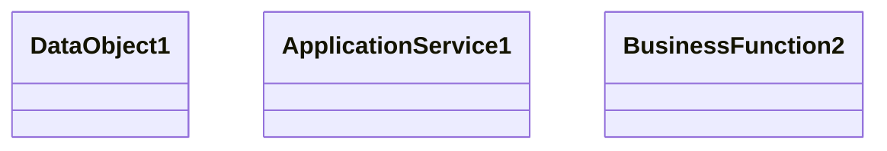

# Sales quote processing - ALD

- **Diagram Type**: Logical
- **Package**: HomerSelect/BSL/Requirements Model/Finished/CSI/CBL-16152 (CSI-1340) Contract service modularization - analysis/Sales quote processing
- **Diagram ID**: 151171
- **Elements**: 3
- **Connectors**: 0

