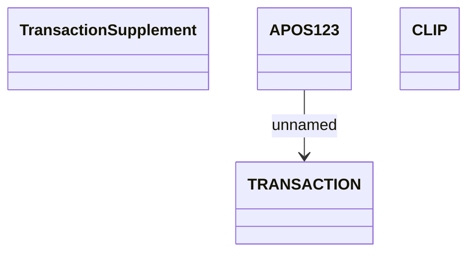

# Contract Supplements usage (object model)

- **Diagram Type**: Logical
- **Package**: HomerSelect/BSL/Requirements Model/Finished/CSI/CBL-16152 (CSI-1340) Contract service modularization - analysis/Service concept (object model)
- **Diagram ID**: 151175
- **Elements**: 4
- **Connectors**: 1

