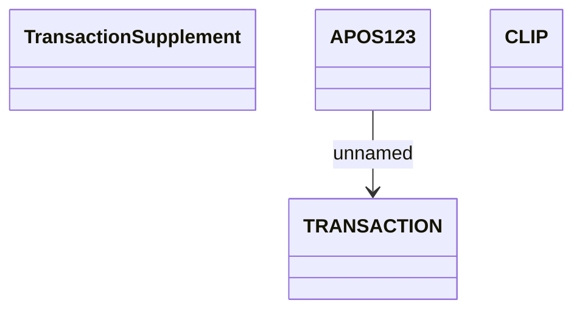

# Contract Supplements usage (object model)

```mermaid
classDiagram
    class TransactionSupplement["TransactionSupplement"]
    class APOS123["APOS123"]
    class CLIP["CLIP"]
    class TRANSACTION["TRANSACTION"]
    APOS123 --> TRANSACTION : unnamed
```
