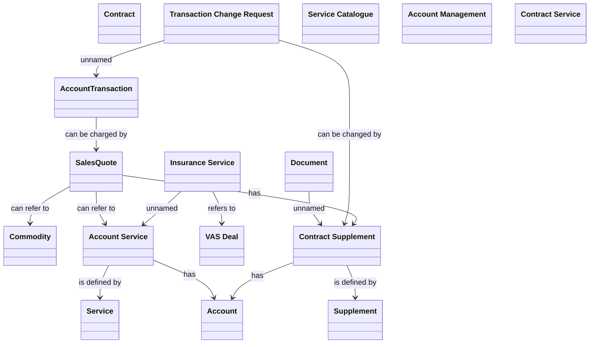

# VAS Service concept (classes)

```mermaid
classDiagram
    class Contract["Contract"]
    class Commodity["Commodity"]
    class Insurance_Service["Insurance Service"]
    class SalesQuote["SalesQuote"]
    class Transaction_Change_Request["Transaction Change Request"]
    class AccountTransaction["AccountTransaction"]
    class Document["Document"]
    class Supplement["Supplement"]
    class Contract_Supplement["Contract Supplement"]
    class VAS_Deal["VAS Deal"]
    class Account_Service["Account Service"]
    class Account["Account"]
    class Service["Service"]
    class Service_Catalogue["Service Catalogue"]
    class Account_Management["Account Management"]
    class Contract_Service["Contract Service"]
    class Contract_Supplement["Contract Supplement"]
    SalesQuote --> Commodity : can refer to
    Account_Service --> Service : is defined by
    Contract_Supplement --> Account : has
    Account_Service --> Account : has
    Insurance_Service --> Account_Service : unnamed
    SalesQuote --> Account_Service : can refer to
    Insurance_Service --> VAS_Deal : refers to
    SalesQuote --> Contract_Supplement : has
    Transaction_Change_Request --> Contract_Supplement : can be changed by
    Document --> Contract_Supplement : unnamed
    Contract_Supplement --> Supplement : is defined by
    Transaction_Change_Request --> AccountTransaction : unnamed
    AccountTransaction --> SalesQuote : can be charged by
```
