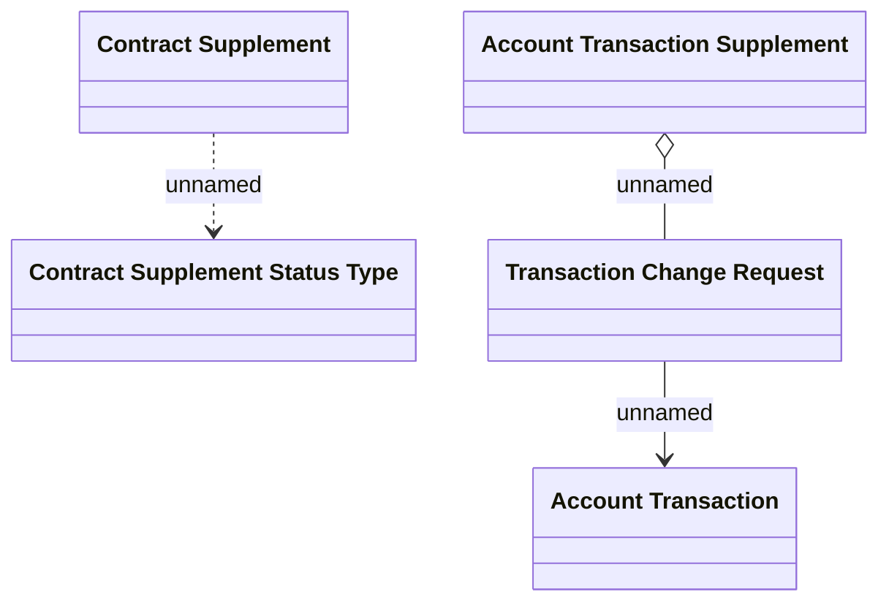

# Change in Contract Supplement domain model

- **Diagram Type**: Logical
- **Package**: HomerSelect/BSL/Requirements Model/Finished/CSI/CBL-16689 (CSI-1531) BNPL Cancellation - API/Process
- **Diagram ID**: 159740
- **Elements**: 5
- **Connectors**: 3

