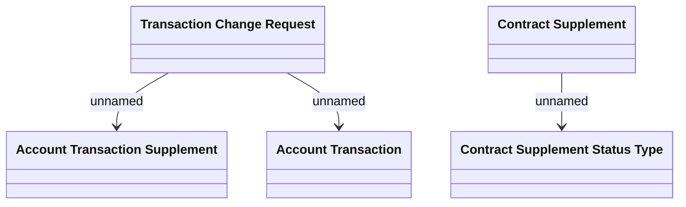

# Change in Contract Supplement domain model

```mermaid
classDiagram
    class Transaction_Change_Request["Transaction Change Request"]
    class Account_Transaction["Account Transaction"]
    class Account_Transaction_Supplement["Account Transaction Supplement"]
    class Contract_Supplement_Status_Type["Contract Supplement Status Type"]
    class Contract_Supplement["Contract Supplement"]
    Transaction_Change_Request --> Account_Transaction_Supplement : unnamed
    Transaction_Change_Request --> Account_Transaction : unnamed
    Contract_Supplement --> Contract_Supplement_Status_Type : unnamed
```
