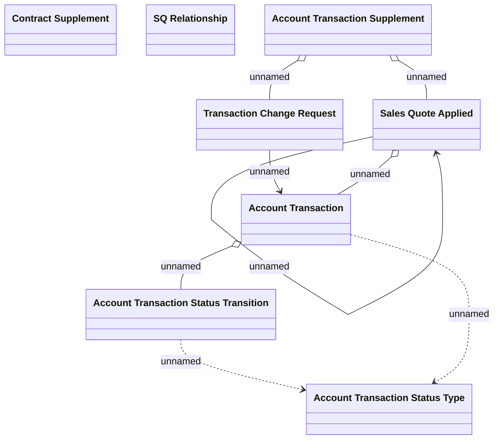

# CSI-1740 - Update TransactionSupplement domain

- **Diagram Type**: Logical
- **Package**: HomerSelect/BSL/Requirements Model/Finished/CSI/CBL-16736 (CSI-1550) EMI Card - VAS as a service -Termination/CSI-1740 - Update method for TransactionSupplement creation
- **Diagram ID**: 145941
- **Elements**: 8
- **Connectors**: 8

