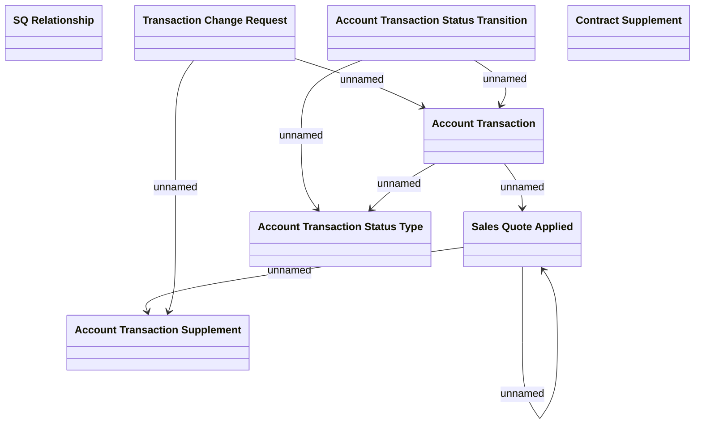

# CSI-1740 - Update TransactionSupplement domain

```mermaid
classDiagram
    class SQ_Relationship["SQ Relationship"]
    class Sales_Quote_Applied["Sales Quote Applied"]
    class Account_Transaction_Status_Type["Account Transaction Status Type"]
    class Account_Transaction_Status_Transition["Account Transaction Status Transition"]
    class Account_Transaction["Account Transaction"]
    class Transaction_Change_Request["Transaction Change Request"]
    class Account_Transaction_Supplement["Account Transaction Supplement"]
    class Contract_Supplement["Contract Supplement"]
    Sales_Quote_Applied --> Account_Transaction_Supplement : unnamed
    Sales_Quote_Applied --> Sales_Quote_Applied : unnamed
    Transaction_Change_Request --> Account_Transaction : unnamed
    Transaction_Change_Request --> Account_Transaction_Supplement : unnamed
    Account_Transaction_Status_Transition --> Account_Transaction : unnamed
    Account_Transaction_Status_Transition --> Account_Transaction_Status_Type : unnamed
    Account_Transaction --> Account_Transaction_Status_Type : unnamed
    Account_Transaction --> Sales_Quote_Applied : unnamed
```
