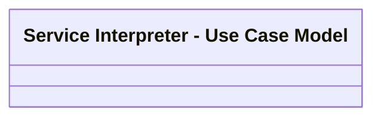

# CSI-1986 SIR - Processing Contract Supplement notifications

- **Diagram Type**: Logical
- **Package**: HomerSelect/BSL/Requirements Model/Finished/CSI/CBL-16736 (CSI-1550) EMI Card - VAS as a service -Termination/CSI-1986 SIR - Processing Contract Supplement notifications
- **Diagram ID**: 146958
- **Elements**: 1
- **Connectors**: 0

