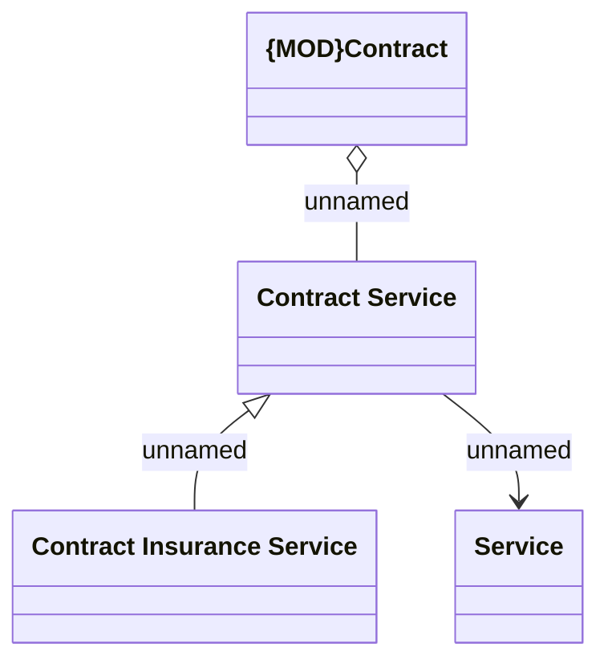

# CSI-1881 Update of the Contract Service domain

- **Diagram Type**: Logical
- **Package**: HomerSelect/BSL/Requirements Model/Finished/CSI/CBL-16736 (CSI-1550) EMI Card - VAS as a service -Termination/Update BSL Contract Service methods/CSI-1881 Update of the Create Contract Service method for new Service Catalog
- **Diagram ID**: 146463
- **Elements**: 4
- **Connectors**: 3

