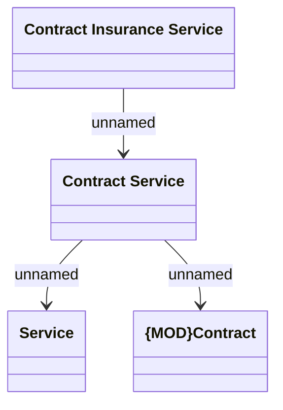

# CSI-1881 Update of the Contract Service domain

```mermaid
classDiagram
    class Contract_Insurance_Service["Contract Insurance Service"]
    class Service["Service"]
    class Contract_Service["Contract Service"]
    class MOD_Contract["{MOD}Contract"]
    Contract_Insurance_Service --> Contract_Service : unnamed
    Contract_Service --> Service : unnamed
    Contract_Service --> MOD_Contract : unnamed
```
