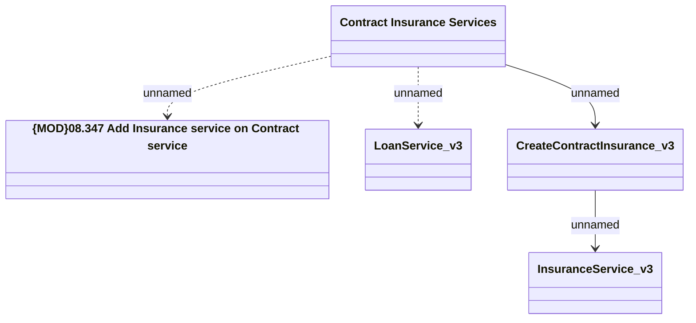

# CSI-1882 Update of the Add Insurance Service method for new Service Catalogue

- **Diagram Type**: Logical
- **Package**: HomerSelect/BSL/Requirements Model/Finished/CSI/CBL-16736 (CSI-1550) EMI Card - VAS as a service -Termination/Update BSL Contract Service methods/CSI-1882 Update of the Add Insurance Service method for new Service Catalogue
- **Diagram ID**: 146451
- **Elements**: 5
- **Connectors**: 4

