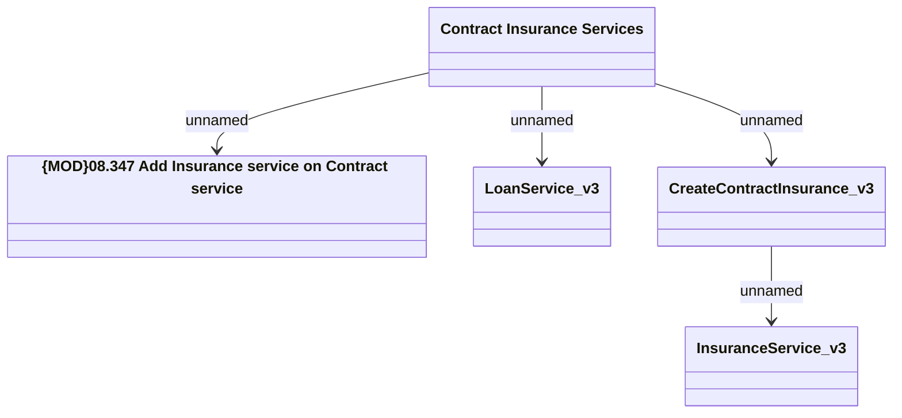

# CSI-1882 Update of the Add Insurance Service method for new Service Catalogue

```mermaid
classDiagram
    class MOD_08_347_Add_Insurance_service_on_Contract_service["{MOD}08.347 Add Insurance service on Contract service"]
    class LoanService_v3["LoanService_v3"]
    class Contract_Insurance_Services["Contract Insurance Services"]
    class InsuranceService_v3["InsuranceService_v3"]
    class CreateContractInsurance_v3["CreateContractInsurance_v3"]
    CreateContractInsurance_v3 --> InsuranceService_v3 : unnamed
    Contract_Insurance_Services --> MOD_08_347_Add_Insurance_service_on_Contract_service : unnamed
    Contract_Insurance_Services --> LoanService_v3 : unnamed
    Contract_Insurance_Services --> CreateContractInsurance_v3 : unnamed
```
