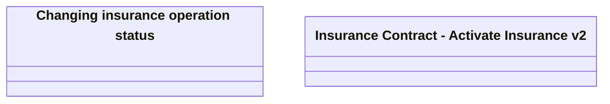

# CSI-1959 Update Insurance Service activation method

- **Diagram Type**: Logical
- **Package**: HomerSelect/BSL/Requirements Model/Finished/CSI/CBL-16736 (CSI-1550) EMI Card - VAS as a service -Termination/Update BSL Contract Service methods/CSI-1959 Update Insurance Service activation method
- **Diagram ID**: 146691
- **Elements**: 2
- **Connectors**: 0

