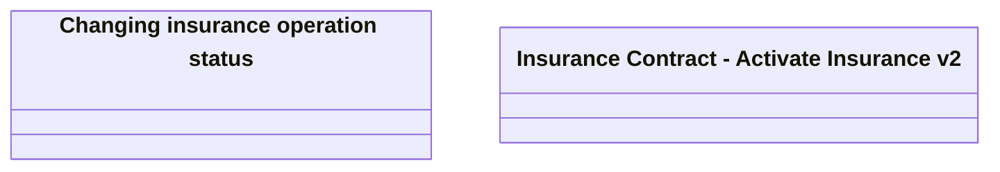

# CSI-1959 Update Insurance Service activation method

```mermaid
classDiagram
    class Changing_insurance_operation_status["Changing insurance operation status"]
    class Insurance_Contract_Activate_Insurance_v2["Insurance Contract - Activate Insurance v2"]
```
