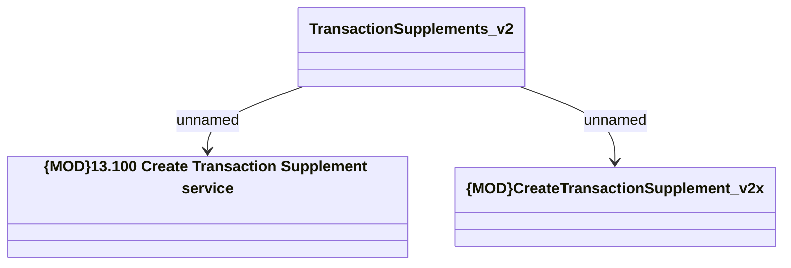

# BNPL - Create Transaction Supplement

```mermaid
classDiagram
    class MOD_CreateTransactionSupplement_v2x["{MOD}CreateTransactionSupplement_v2x"]
    class TransactionSupplements_v2["TransactionSupplements_v2"]
    class MOD_13_100_Create_Transaction_Supplement_service["{MOD}13.100 Create Transaction Supplement service"]
    TransactionSupplements_v2 --> MOD_13_100_Create_Transaction_Supplement_service : unnamed
    TransactionSupplements_v2 --> MOD_CreateTransactionSupplement_v2x : unnamed
```
