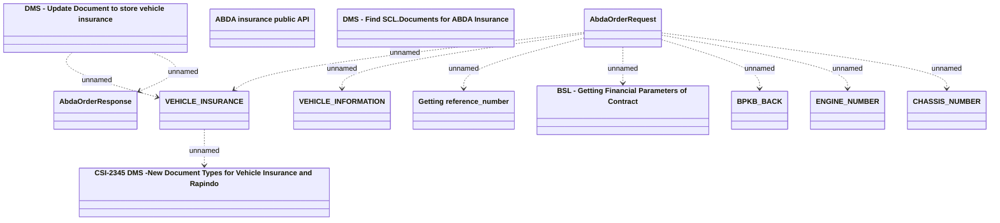

# ABDA request - data mapping

- **Diagram Type**: Logical
- **Package**: HomerSelect/BSL/Requirements Model/Finished/CSI/CBL-19452 [SCL] (CSI-2284) ABDA Insurance Order Integration/ABDA request - data mapping
- **Diagram ID**: 160580
- **Elements**: 13
- **Connectors**: 10

