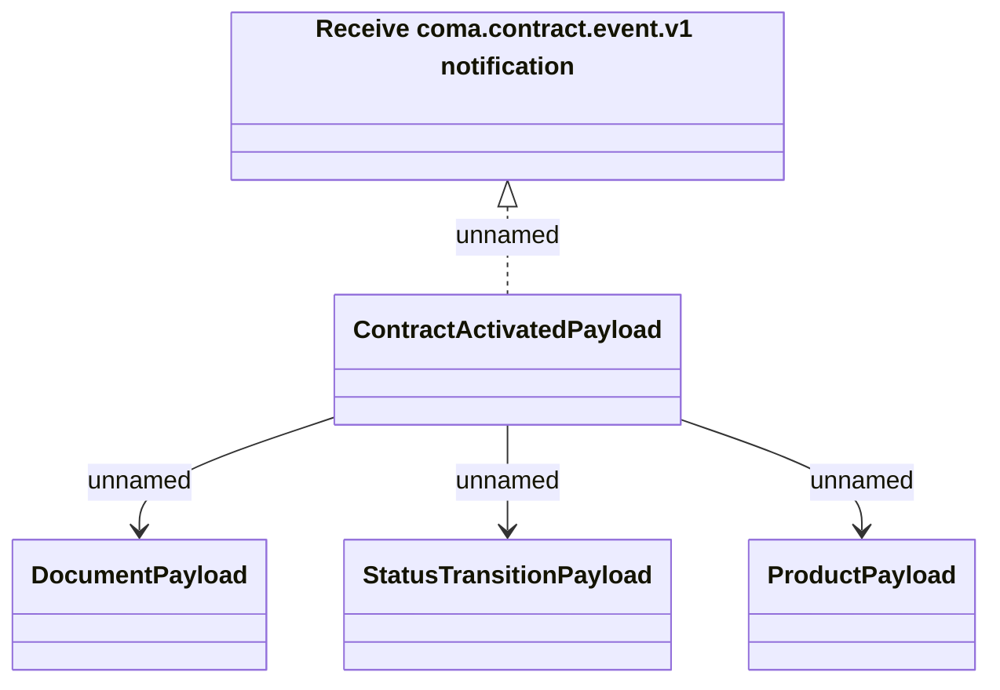

# ContractActivated notification data

- **Diagram Type**: Logical
- **Package**: HomerSelect/BSL/Requirements Model/Finished/CSI/CBL-19452 [SCL] (CSI-2284) ABDA Insurance Order Integration/ContractActivated notification data
- **Diagram ID**: 150492
- **Elements**: 5
- **Connectors**: 4

