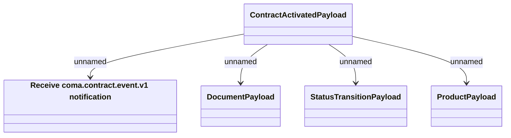

# ContractActivated notification data

```mermaid
classDiagram
    class ProductPayload["ProductPayload"]
    class StatusTransitionPayload["StatusTransitionPayload"]
    class DocumentPayload["DocumentPayload"]
    class ContractActivatedPayload["ContractActivatedPayload"]
    class Receive_coma_contract_event_v1_notification["Receive coma.contract.event.v1 notification"]
    ContractActivatedPayload --> Receive_coma_contract_event_v1_notification : unnamed
    ContractActivatedPayload --> DocumentPayload : unnamed
    ContractActivatedPayload --> StatusTransitionPayload : unnamed
    ContractActivatedPayload --> ProductPayload : unnamed
```
