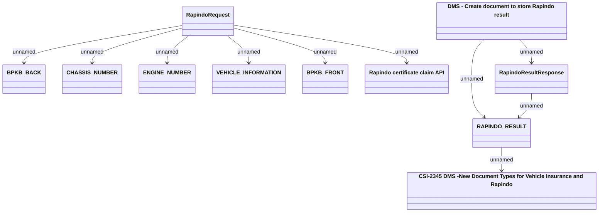

# RAPINDO request mapping

```mermaid
classDiagram
    class Rapindo_certificate_claim_API["Rapindo certificate claim API"]
    class RapindoResultResponse["RapindoResultResponse"]
    class DMS_Create_document_to_store_Rapindo_result["DMS - Create document to store Rapindo result"]
    class RAPINDO_RESULT["RAPINDO_RESULT"]
    class CSI_2345_DMS_New_Document_Types_for_Vehicle_Insurance_and_Ra["CSI-2345 DMS -New Document Types for Vehicle Insurance and Rapindo"]
    class BPKB_FRONT["BPKB_FRONT"]
    class VEHICLE_INFORMATION["VEHICLE_INFORMATION"]
    class ENGINE_NUMBER["ENGINE_NUMBER"]
    class CHASSIS_NUMBER["CHASSIS_NUMBER"]
    class BPKB_BACK["BPKB_BACK"]
    class RapindoRequest["RapindoRequest"]
    RapindoRequest --> BPKB_BACK : unnamed
    RapindoRequest --> CHASSIS_NUMBER : unnamed
    RapindoRequest --> ENGINE_NUMBER : unnamed
    RapindoRequest --> VEHICLE_INFORMATION : unnamed
    RapindoRequest --> BPKB_FRONT : unnamed
    RAPINDO_RESULT --> CSI_2345_DMS_New_Document_Types_for_Vehicle_Insurance_and_Ra : unnamed
    RapindoResultResponse --> RAPINDO_RESULT : unnamed
    DMS_Create_document_to_store_Rapindo_result --> RAPINDO_RESULT : unnamed
    DMS_Create_document_to_store_Rapindo_result --> RapindoResultResponse : unnamed
    RapindoRequest --> Rapindo_certificate_claim_API : unnamed
```
