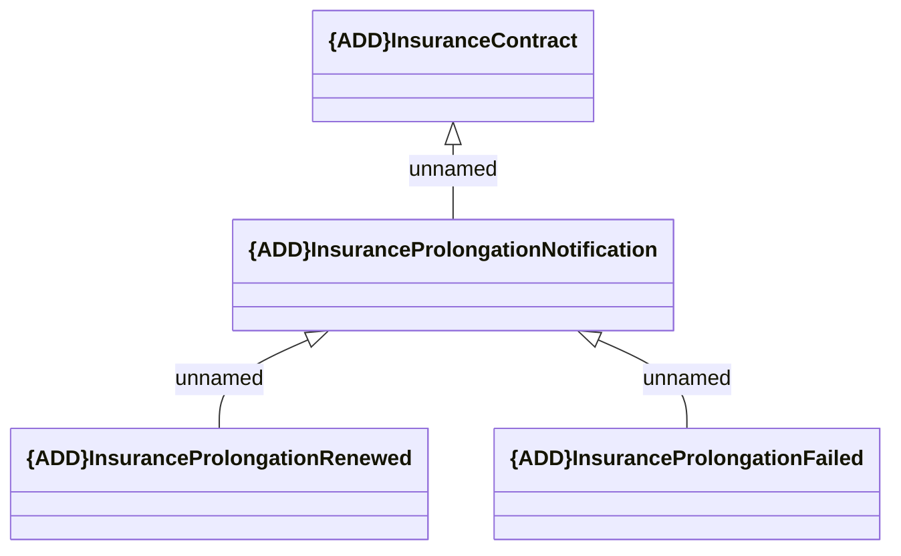

# Insurance Prolongation notification

- **Diagram Type**: Logical
- **Package**: HomerSelect/BSL/Requirements Model/Finished/CSI/CBL-22680 Service Management Modules for REL (KZ)/CSI-3088 VAS - Deal (Insurance) Prolongation notification
- **Diagram ID**: 155808
- **Elements**: 4
- **Connectors**: 3

