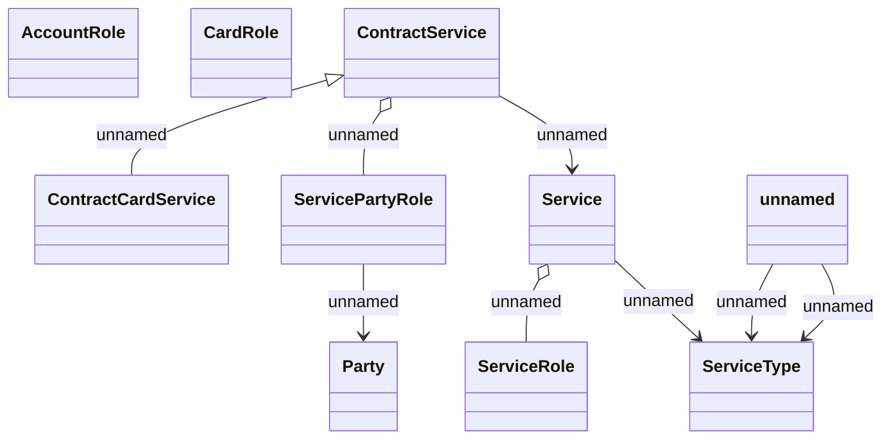

# SME Classes

- **Diagram Type**: Logical
- **Package**: HomerSelect/BSL/Requirements Model/Finished/CSI/CBL-22777 (CSI-3042) SME Project - Additional Cards for SME account/SME Object Model
- **Diagram ID**: 157245
- **Elements**: 11
- **Connectors**: 8

