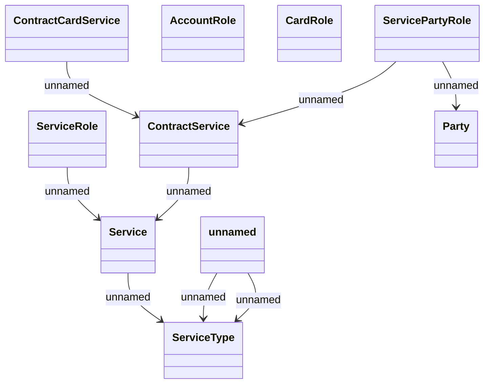

# SME Classes

```mermaid
classDiagram
    class ServiceType["ServiceType"]
    class ServiceRole["ServiceRole"]
    class ContractCardService["ContractCardService"]
    class AccountRole["AccountRole"]
    class CardRole["CardRole"]
    class ServicePartyRole["ServicePartyRole"]
    class Party["Party"]
    class ContractService["ContractService"]
    class Service["Service"]
    Service --> ServiceType : unnamed
    ContractService --> Service : unnamed
    ServicePartyRole --> ContractService : unnamed
    ServicePartyRole --> Party : unnamed
    unnamed --> ServiceType : unnamed
    ContractCardService --> ContractService : unnamed
    ServiceRole --> Service : unnamed
    unnamed --> ServiceType : unnamed
```
